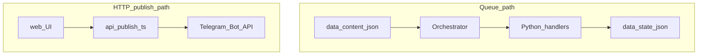

# Architecture

## Overview

An admin-only Telegram bot (MVP) built with **python-telegram-bot** 21+ (`Application`, `CommandHandler`, `CallbackQueryHandler`). It exposes `/start` (intro + inline **Next** / **Status**), `/next`, and `/status`. **Command menu** (`set_my_commands`): empty default scope; `/start`, `/next`, `/status` registered for the admin’s private chat (`BotCommandScopeChat(ADMIN_CHAT_ID)`). Canonical user-facing English strings and BotFather paste text live in `bot/bot_copy.py`. Only the configured **admin user** (Telegram user id in `ADMIN_CHAT_ID`) can use commands or callbacks. Optional **scheduled** delivery (08:00, 08:15, 08:30, 19:00, 19:15, and 19:30 local time via `SCHEDULE_TZ`) uses the same queue as `/next` when `ENABLE_SCHEDULED_POSTING` is enabled.

## Runtime flow

1. **Entry**: `run.py` calls `bot.main.run_bot()`.
2. **Startup**: `validate_config()` ensures `BOT_TOKEN` and `ADMIN_CHAT_ID` are set. `logging.basicConfig` uses `resolve_log_level()` from `config.py` (optional `LOG_LEVEL` env). An `Orchestrator` is constructed with paths from `config.py`, then `load_manifest()` loads `data/content.json`.
3. **Application**: `Application.builder().token(...).post_init(...).build()` runs **`post_init`** to register bot commands (scoped menu for admin DM only), registers command + callback handlers, and a **global `error_handler`** that logs uncaught exceptions from update handlers (it does not send user-facing Telegram text). `bot_data` holds `orchestrator`, `admin_chat_id` (the admin’s numeric **user** id; env name unchanged), and when scheduling is on, `schedule_target_chat_id` (resolved at startup: explicit `SCHEDULE_TARGET_CHAT_ID` or, if unset, **`ADMIN_CHAT_ID`** — see `validate_config()` in `config.py`).
4. **Optional jobs**: If `ENABLE_SCHEDULED_POSTING`, `application.job_queue` registers six `run_daily` jobs (`scheduled_morning_1`…`scheduled_morning_3`, `scheduled_evening_1`…`scheduled_evening_3` at 08:00, 08:15, 08:30, 19:00, 19:15, 19:30) calling `run_scheduled_delivery` in `bot/handlers.py` (same peek → send → `record_delivered` contract as `/next`). Requires `python-telegram-bot[job-queue]` and a valid IANA `SCHEDULE_TZ` (default `Europe/Vilnius`); `tzdata` is listed in `requirements.txt` for Windows `ZoneInfo` support.
5. **Polling**: `application.run_polling(drop_pending_updates=True)`.

Run **one** bot process when scheduling is enabled; multiple processes sharing `state.json` can interleave queue advances.

## Modules

| Module | Responsibility |
|--------|------------------|
| `config.py` | `BASE_DIR`, `CONTENT_PATH`, `STATE_PATH` (default `data/state.json`; override with env **`QUEUE_STATE_PATH`** for hosts like Railway + volume), env vars, `validate_config()` (incl. optional schedule flags), `resolve_log_level()` |
| `bot/main.py` | Build app, wire `bot_data`, **`post_init`** (`set_my_commands`), optional `JobQueue` daily jobs, register handlers, start polling |
| `bot/handlers.py` | Admin check, `/start`, `/next`, `/status`, inline **`callback_nav`** (`nav_next` / `nav_status`); shared **`_run_next`** / **`_run_status`**; `send_content_item`, `run_scheduled_delivery`; send text, photo, document, or **poll** (Telegram quiz) per `ContentItem`; **`split_telegram_text_chunks`** splits **`text`** bodies and poll **`theme_note`** into ≤ **`MAX_MESSAGE_CHARS`** (4096) segments; shared **`asyncio.Lock`** (`_next_lock`) serializes `/next`, callbacks, and scheduled delivery |
| `bot/bot_copy.py` | Canonical EN copy: `/start` body, BotFather Description/About (manual paste), `bot_menu_commands()` for `set_my_commands` |
| `orchestrator.py` | Load manifest, `peek_next_item` / `record_delivered`, `status_text()` (includes next item `id` and `type`, same rule as `peek_next_item`) |
| `content_loader.py` | Read JSON from disk, `parse_manifest()` |
| `schemas.py` | `ContentItem`, `ContentManifest`, manifest validation (`version` must be `1`; optional media `caption` max `MAX_CAPTION_CHARS`) |
| `state_store.py` | Load/save queue state JSON (`config.STATE_PATH`) with atomic write and `updated_at` timestamp |

## Keep it simple (KISS)

**Principle:** make the **smallest change** that solves the task. Do not add a second queue, a second on-disk state shape, or parallel sources of truth if extending the existing manifest or orchestrator is enough.

**Keep as-is (do not over-engineer):**

1. **One send path** — `bot/handlers.py` uses `send_content_item` by `ContentItem.type` for both `/next` and scheduled jobs; no duplicate send logic.
2. **One in-process serializer for queue delivery** — `asyncio.Lock` (`_next_lock`) around peek → send → `record_delivered` for `/next` and `run_scheduled_delivery`; skip distributed locking until multiple writers target the same `state.json`.
3. **Flat startup** — `run.py` + `bot/main.py` without a DI container; env via `config.py` and `.env`.
4. **English copy in Telegram only** — all strings the bot **sends** to users are **English** (see `project-core.mdc`). No i18n framework for the MVP. Other layers may use non-English messages (e.g. Lithuanian strings in `validate_config()`, `content_loader` / `schemas` validation text); those are for operators and logs, not Telegram replies.
5. **Single admin gate** — reuse `_deny_if_not_admin` for every privileged command; it compares `update.effective_user.id` to the configured admin user id.

**Checklist before adding code:**

- Can the logic live in `orchestrator.py` or `schemas.py` instead of a new module?
- Does every new manifest field validate only in `parse_manifest`, not again in handlers?
- Does state stay **one** JSON object with clear keys (`last_delivered_id`, `updated_at`)?

## Long-lived core (contracts)

**Principle:** orchestrator + manifest schema + atomic state is the product core—invest tests and features there; the Telegram layer stays a thin adapter.

**Orchestrator / queue (`orchestrator.py`):**

- `peek_next_item` **never** writes disk (reads manifest + state only).
- `record_delivered` runs **only after** a successful send (see `cmd_next` and `run_scheduled_delivery` in `bot/handlers.py`). Failed peek or failed send must not advance `last_delivered_id`. If `record_delivered` fails after a successful send (e.g. disk error), `/next` replies in-chat with a short English warning; scheduled jobs send the same text to the admin DM when `SCHEDULE_NOTIFY_ON_FAILURE` is on (default). `last_delivered_id` may not advance until state saves successfully.
- If `last_delivered_id` is missing from the ordered item list, the next item is the **first** (recovery after content edits).
- **JobQueue** automation repeats the same sequence: peek → send → `record_delivered` on success (`run_scheduled_delivery`).

**Manifest (`schemas.parse_manifest`, invoked from `content_loader.load_content`):**

- `version` must be `1` (a new version = new contract or file, not silent breakage).
- Media paths are resolved only under `base_dir`; stored as absolute `Path` after validation.
- Item `id` values must be **unique** so `_next_after` is deterministic.
- Optional `caption` on `photo` / `document` items is validated to **at most 140 characters** when present (`schemas.MAX_CAPTION_CHARS`); see **Image or document plus long copy** below.
- **`poll`** items map to Telegram quiz polls (`send_poll` with `PollType.QUIZ`). If `theme_note` is set, a follow-up `send_message` runs after the poll (debrief). Authoring and merging from `posts.json` + `data/polls.json`: [QUEUE_SYNC.md](QUEUE_SYNC.md).

**State (`state_store.py`):**

- Reads/writes go through `load` / `save_atomic` / `default_state`—handlers do not edit `state.json` directly.
- `updated_at` is refreshed on every successful write (UTC ISO).
- Missing file: default state. Invalid shape: explicit `ValueError`. Malformed JSON raises `json.JSONDecodeError` (subclass of `ValueError`), which handlers treat like other load errors—no silent bad data.

**Startup (`bot/main.py`):**

- `load_manifest()` runs before `run_polling` so invalid `content.json` fails fast, not on first `/next`.

**Tests as contract witnesses:** `tests/test_orchestrator.py`, `tests/test_schemas.py`, `tests/test_state_store.py`, `tests/test_content_loader.py`, `tests/test_handlers_next.py` (`/next` order with mocks), `tests/test_handlers_start_nav.py` (`/start` + inline callbacks), `tests/test_handlers_scheduled.py` (scheduled callback), `tests/test_queue_manifest_sync.py` (posts + polls → manifest), `tests/test_config_validate.py`, `tests/test_config_log_level.py`.

## Telegram delivery paths

The repository exposes **two independent families** of sends to Telegram: the **manifest queue** (manual `/next` and optional **scheduled** jobs share `Orchestrator` and `state.json`), and **HTTP publish** (separate; no queue cursor).

| Path | Entry | Content source | State |
|------|--------|----------------|--------|
| **Polling bot (queue)** | `python run.py` → [`bot/main.py`](../bot/main.py) | `data/content.json` via `Orchestrator` | `last_delivered_id` in the state file (default `data/state.json`, or **`QUEUE_STATE_PATH`**) advances only after a successful bot send (`peek` → send → `record_delivered`) |
| **Scheduled queue** | Same process: `JobQueue` → `run_scheduled_delivery` | Same manifest and `Orchestrator` as `/next` | Same as queue; sends to `SCHEDULE_TARGET_CHAT_ID` if set, else `ADMIN_CHAT_ID` (see **Target chat** below) |
| **HTTP publish (web UI)** | Browser → `POST /api/publish` → [`api/publish.ts`](../api/publish.ts) | Post text from the social copy UI (not the manifest queue); optional `photo` URL (HTTPS, **same host** as the request) for `sendPhoto` | No queue cursor; caption up to ~1024 characters, then remaining text in ~4096-character messages |

Vercel env vars, bearer auth, and publish behaviour (text + optional image URL, same-host check on `photo`) are documented in [`web/README.md`](../web/README.md) (`PUBLISH_BEARER_TOKEN`, `TELEGRAM_BOT_TOKEN` or `BOT_TOKEN`, `TELEGRAM_PUBLISH_CHAT_ID` or `PUBLISH_CHAT_ID`).

## Data

- **`data/content.json`**: Manifest with `version: 1` and `items[]`. Each item has `id`, `type` (`text` \| `photo` \| `document` \| `poll`), and fields per type (e.g. `text`, or `path` relative to repo root for media with optional `caption` up to **140** characters when set; for **`poll`**, quiz fields `question`, `options`, `correct_option_id`, plus optional `theme_note` and `related_post_id`—see `parse_manifest` in [`schemas.py`](../schemas.py) and [QUEUE_SYNC.md](QUEUE_SYNC.md)).
- **Queue state file** (default **`data/state.json`**; set **`QUEUE_STATE_PATH`** for a persistent path, e.g. on a Railway volume): `last_delivered_id` (string or null), `updated_at` (ISO string), optional `x_posted_item_ids`. Created/updated by `state_store.save_atomic`.

## Queue semantics

`Orchestrator.peek_next_item()` reloads the manifest and state, finds the item after `last_delivered_id` in order (wraps to the first item), and returns that `ContentItem` **without** writing state. After a successful Telegram send, the handler calls `record_delivered(item.id)` so `last_delivered_id` reflects only delivered content. If `last_delivered_id` is missing or unknown, the next item is the first in the manifest.

`Orchestrator.status_text()` (used by `/status`) reports item count, last delivered id, `updated_at`, and a **Next** line with the same upcoming item as `peek_next_item()` would return (`id` and `type` only). If the in-memory manifest has no items (defensive branch; `parse_manifest` normally rejects an empty `items` list), it reports `Next: none (empty queue)`.

## Image or document plus long copy (Telegram and cross-channel)

**Telegram Bot API (context):** media captions are limited to about **1024** characters; plain message text to about **4096** characters. Putting a long “LinkedIn-style” body entirely in a photo caption hits the caption limit and weakens the post.

**Recommended pattern in this repo (no extra schema fields):** use **two consecutive `items`** in `content.json`:

1. A **`photo`** or **`document`** item with an optional **`caption`** that acts as a short **hook**. The manifest enforces **at most 140 characters** for `caption` when it is set. That hook is suitable for Telegram’s caption and, when optional X posting is enabled, is reused as the **X post text** for **`photo`** items only (same file + caption).
2. A following **`text`** item with the **full body**, including any **call to action**. That long block is delivered via `send_message` and is **not** posted to X—the X path uses only the hook-sized caption on the preceding **`photo`** item.

**Optional X (Twitter) mirror:** when `ENABLE_X_POSTING` and Twitter OAuth env vars are set (`config.validate_config`), `bot/handlers.py` calls `x_poster.post_photo_with_caption` **after** a successful Telegram `send_photo` and **before** `record_delivered`. Only **`photo`** manifest items are mirrored; **`text`**, **`poll`**, and **`document`** are skipped. X failure does not block the queue: `last_delivered_id` still advances. Successful X posts for an item `id` are tracked in `state.json` under **`x_posted_item_ids`** (`state_store.load` / `Orchestrator.mark_x_posted`) to avoid duplicate X posts if the same item is ever retried after a partial failure.

One logical “drop” therefore requires **two `/next` invocations** in order. The queue is **cyclic**: after the last item, the next item wraps to the first—keep paired hook + body entries adjacent in the manifest if you want them delivered back-to-back in each cycle.

## Scheduled posting (configuration)

- **`ENABLE_SCHEDULED_POSTING`**: when true, six daily jobs run at **08:00**, **08:15**, **08:30**, **19:00**, **19:15**, and **19:30** in `SCHEDULE_TZ` (IANA; default `Europe/Vilnius`).
- **`SCHEDULE_TARGET_CHAT_ID`**: optional in `.env`. If unset, **`validate_config()`** sets the runtime target to **`ADMIN_CHAT_ID`** (private DM with the bot). If you use `/next` in a **group**, the group’s chat id differs from your user id—set `SCHEDULE_TARGET_CHAT_ID` to that group id so scheduled posts land in the same place as manual `/next` there.

`schedule_next_delivery()` in `orchestrator.py` remains a no-op stub; timing is owned by `JobQueue` in `bot/main.py`.

## Production shape (hosting)

- **Queue bot** (`run.py`, polling, optional `JobQueue`): deployed as one long-running worker on **[Railway](https://railway.com/)** — see [RUNBOOK.md](RUNBOOK.md#hosting-the-queue-bot-railway) and repo [`railway.toml`](../railway.toml). Use **`QUEUE_STATE_PATH`** on a mounted volume so redeploys do not reset the queue cursor ([RUNBOOK.md](RUNBOOK.md) — `data/state.json` on Railway).
- **Social web + HTTP publish** (`/api/publish`): **Vercel** (or static host) — separate from the bot process; does not advance `state.json`.

## Future expansion (not implemented)

These items are design hooks and documentation only unless stated otherwise.

### Separate-process automation

An alternative to in-process `JobQueue` is OS **cron** or a small worker that runs the same orchestration path against the same `content.json` and `state.json` (no Flask requirement). The in-repo implementation uses `JobQueue` instead; **Railway** is the chosen host for that worker in production.

### Target chat vs admin

**Authorization** uses `update.effective_user.id` vs `ADMIN_CHAT_ID`. **Manual `/next` delivery** goes to `update.effective_chat.id` (private chat or group where the command was issued). **Scheduled delivery** uses `SCHEDULE_TARGET_CHAT_ID` or defaults to `ADMIN_CHAT_ID`; `Orchestrator` is unchanged.

### Duplicate-send guard (automation)

When posting is automatic, consider a time window (e.g. do not send the same item twice within *N* minutes) or similar guardrails. Not required for manual `/next`.

### Feature flags

Use env-style toggles (e.g. `ENABLE_*`) before enabling new behavior. `ENABLE_SCHEDULED_POSTING` is implemented; other commented keys in `.env.example` may still be placeholders.

### Manifest and “day / cycle” content

The canonical format remains `version: 1` with ordered `items[]` and `last_delivered_id` in state. An alternative “day index + `cycle_length`” model (as in separate concept notes) would be a **new manifest version** or a **separate manifest file**, not a breaking change to the current file—so existing content and tooling keep working.
