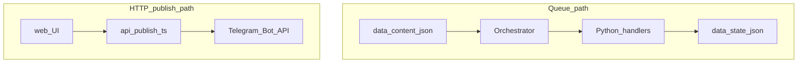

# Architecture

## Overview

An admin-only Telegram bot (MVP) built with **python-telegram-bot** (v20-style `Application` and `CommandHandler`). It exposes `/start`, `/next`, and `/status`. Only the configured **admin user** (Telegram user id in `ADMIN_CHAT_ID`) can use commands.

## Runtime flow

1. **Entry**: `run.py` calls `bot.main.run_bot()`.
2. **Startup**: `validate_config()` ensures `BOT_TOKEN` and `ADMIN_CHAT_ID` are set. `logging.basicConfig` uses `resolve_log_level()` from `config.py` (optional `LOG_LEVEL` env). An `Orchestrator` is constructed with paths from `config.py`, then `load_manifest()` loads `data/content.json`.
3. **Application**: `Application.builder().token(...).build()` registers handlers. `bot_data` holds `orchestrator` and `admin_chat_id` (the admin’s numeric **user** id; env name unchanged).
4. **Polling**: `application.run_polling(drop_pending_updates=True)`.

## Modules

| Module | Responsibility |
|--------|------------------|
| `config.py` | `BASE_DIR`, `CONTENT_PATH`, `STATE_PATH`, env vars, `validate_config()`, `resolve_log_level()` |
| `bot/main.py` | Build app, wire `bot_data`, register handlers, start polling |
| `bot/handlers.py` | Admin check, `/start`, `/next`, `/status`; send text, photo, or document per `ContentItem` |
| `orchestrator.py` | Load manifest, `peek_next_item` / `record_delivered`, `status_text()` |
| `content_loader.py` | Read JSON from disk, `parse_manifest()` |
| `schemas.py` | `ContentItem`, `ContentManifest`, manifest validation (`version` must be `1`; optional media `caption` max `MAX_CAPTION_CHARS`) |
| `state_store.py` | Load/save `data/state.json` with atomic write and `updated_at` timestamp |

## Keep it simple (KISS)

**Principle:** make the **smallest change** that solves the task. Do not add a second queue, a second on-disk state shape, or parallel sources of truth if extending the existing manifest or orchestrator is enough.

**Keep as-is (do not over-engineer):**

1. **One send path** — `bot/handlers.py` uses `_send_item` by `ContentItem.type` only; no extra abstraction layers for the MVP.
2. **One in-process serializer for `/next`** — `asyncio.Lock` (`_next_lock`) around peek → send → `record_delivered` is enough for a single admin and manual `/next`; skip distributed locking until multiple writers target the same `state.json`.
3. **Flat startup** — `run.py` + `bot/main.py` without a DI container; env via `config.py` and `.env`.
4. **English copy in Telegram only** — all strings the bot **sends** to users are **English** (see `project-core.mdc`). No i18n framework for the MVP. (Other layers, e.g. `validate_config()` console errors, may stay non-English.)
5. **Single admin gate** — reuse `_deny_if_not_admin` for every privileged command; it compares `update.effective_user.id` to the configured admin user id.

**Checklist before adding code:**

- Can the logic live in `orchestrator.py` or `schemas.py` instead of a new module?
- Does every new manifest field validate only in `parse_manifest`, not again in handlers?
- Does state stay **one** JSON object with clear keys (`last_delivered_id`, `updated_at`)?

## Marry — long-lived core (contracts)

**Principle:** orchestrator + manifest schema + atomic state is the product core—invest tests and features there; the Telegram layer stays a thin adapter.

**Orchestrator / queue (`orchestrator.py`):**

- `peek_next_item` **never** writes disk (reads manifest + state only).
- `record_delivered` runs **only after** a successful send (see `cmd_next` in `bot/handlers.py`). Failed peek or failed send must not advance `last_delivered_id`. If `record_delivered` fails after a successful send (e.g. disk error), the handler notifies the user and `last_delivered_id` may not advance until state saves successfully.
- If `last_delivered_id` is missing from the ordered item list, the next item is the **first** (recovery after content edits).
- Any future automation (cron, `JobQueue`) should repeat the same sequence: peek → send → `record_delivered` on success (see **Future expansion** below).

**Manifest (`schemas.parse_manifest`, invoked from `content_loader.load_content`):**

- `version` must be `1` (a new version = new contract or file, not silent breakage).
- Media paths are resolved only under `base_dir`; stored as absolute `Path` after validation.
- Item `id` values must be **unique** so `_next_after` is deterministic.
- Optional `caption` on `photo` / `document` items is validated to **at most 140 characters** when present (`schemas.MAX_CAPTION_CHARS`); see **Image or document plus long copy** below.

**State (`state_store.py`):**

- Reads/writes go through `load` / `save_atomic` / `default_state`—handlers do not edit `state.json` directly.
- `updated_at` is refreshed on every successful write (UTC ISO).
- Corrupt or missing file: default state or explicit `ValueError`—no silent bad data.

**Startup (`bot/main.py`):**

- `load_manifest()` runs before `run_polling` so invalid `content.json` fails fast, not on first `/next`.

**Tests as contract witnesses:** `tests/test_orchestrator.py`, `tests/test_schemas.py`, `tests/test_state_store.py`, and `tests/test_handlers_next.py` (handler call order for `/next` with mocks).

## Telegram delivery paths

The repository exposes **two independent ways** to send text to Telegram. They do **not** share runtime state: the HTTP publish path never calls `Orchestrator` and never writes `data/state.json`.

| Path | Entry | Content source | State |
|------|--------|----------------|--------|
| **Polling bot (queue)** | `python run.py` → [`bot/main.py`](../bot/main.py) | `data/content.json` via `Orchestrator` | `last_delivered_id` in `data/state.json` advances only after a successful bot send (`peek` → send → `record_delivered`) |
| **HTTP publish (web UI)** | Browser → `POST /api/publish` → [`api/publish.ts`](../api/publish.ts) | Free-form post body from the social copy UI (not the manifest queue) | No queue cursor; long text is split server-side to fit Telegram’s ~4096-character message limit |

Vercel env vars, bearer auth, and limitations (e.g. **text-only**; images from `posts.json` are not sent through this API) are documented in [`web/README.md`](../web/README.md) (`PUBLISH_BEARER_TOKEN`, `TELEGRAM_BOT_TOKEN` or `BOT_TOKEN`, `TELEGRAM_PUBLISH_CHAT_ID` or `PUBLISH_CHAT_ID`).

## Data

- **`data/content.json`**: Manifest with `version: 1` and `items[]`. Each item has `id`, `type` (`text` \| `photo` \| `document`), and fields per type (e.g. `text`, or `path` relative to repo root for media, optional `caption` up to **140** characters when set—enforced in `parse_manifest`).
- **`data/state.json`**: `last_delivered_id` (string or null), `updated_at` (ISO string). Created/updated by `state_store.save_atomic`.

## Queue semantics

`Orchestrator.peek_next_item()` reloads the manifest and state, finds the item after `last_delivered_id` in order (wraps to the first item), and returns that `ContentItem` **without** writing state. After a successful Telegram send, the handler calls `record_delivered(item.id)` so `last_delivered_id` reflects only delivered content. If `last_delivered_id` is missing or unknown, the next item is the first in the manifest.

## Image or document plus long copy (Telegram and cross-channel)

**Telegram Bot API (context):** media captions are limited to about **1024** characters; plain message text to about **4096** characters. Putting a long “LinkedIn-style” body entirely in a photo caption hits the caption limit and weakens the post.

**Recommended pattern in this repo (no extra schema fields):** use **two consecutive `items`** in `content.json`:

1. A **`photo`** or **`document`** item with an optional **`caption`** that acts as a short **hook**. The manifest enforces **at most 140 characters** for `caption` when it is set. That hook is suitable for Telegram’s caption and is intended to double as copy for a future **X/Twitter**-style short post (same text source).
2. A following **`text`** item with the **full body**, including any **call to action**. That long block is delivered via `send_message` and is **not** intended for reuse on Twitter when a short-form integration is added—the Twitter path should use only the hook-sized caption field.

One logical “drop” therefore requires **two `/next` invocations** in order. The queue is **cyclic**: after the last item, the next item wraps to the first—keep paired hook + body entries adjacent in the manifest if you want them delivered back-to-back in each cycle.

## Future expansion (not implemented)

These items are design hooks and documentation only; the current MVP does not implement them.

### Scheduler and `schedule_next_delivery`

`schedule_next_delivery()` in `orchestrator.py` remains a reserved stub. When automation is added, two reasonable approaches are:

- **In-process**: python-telegram-bot `JobQueue` (periodic job calling the same flow as `/next`: peek → send → `record_delivered` on success).
- **Separate process**: OS cron or a small worker that runs the same orchestration path against the same `content.json` and `state.json` (no Flask requirement).

Either way, reusing the existing orchestrator semantics avoids duplicating queue rules.

### Target chat vs admin

**Authorization** uses `update.effective_user.id` vs `ADMIN_CHAT_ID`. **Delivery** still goes to `update.effective_chat.id` (private chat or group where the command was issued). A later channel workflow could use a configurable `chat_id` (or channel username) for sends while keeping admin-only commands; queue logic in `Orchestrator` would stay unchanged—only the send target would be configurable.

### Duplicate-send guard (automation)

When posting is automatic, consider a time window (e.g. do not send the same item twice within *N* minutes) or similar guardrails. Not required for manual `/next`.

### Feature flags

Use env-style toggles (e.g. `ENABLE_*`) before enabling new behavior; commented placeholders live in `.env.example` until the code reads them.

### Manifest and “day / cycle” content

The canonical format remains `version: 1` with ordered `items[]` and `last_delivered_id` in state. An alternative “day index + `cycle_length`” model (as in separate concept notes) would be a **new manifest version** or a **separate manifest file**, not a breaking change to the current file—so existing content and tooling keep working.
